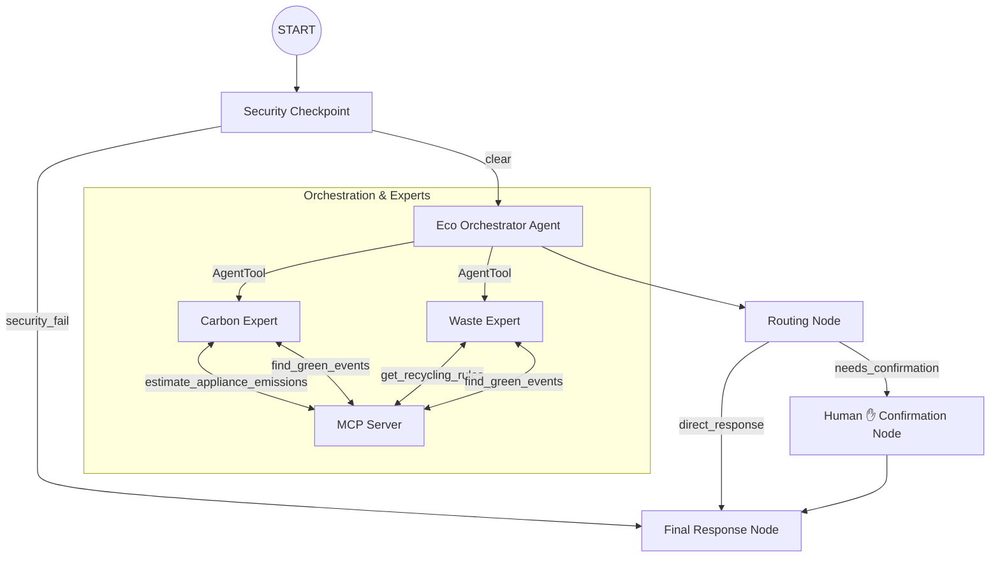
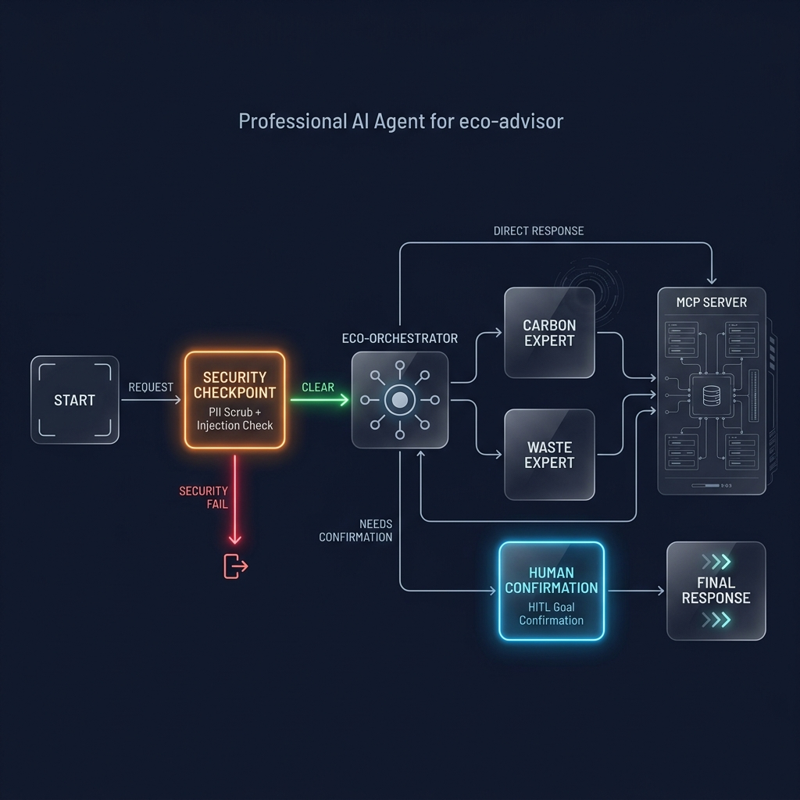
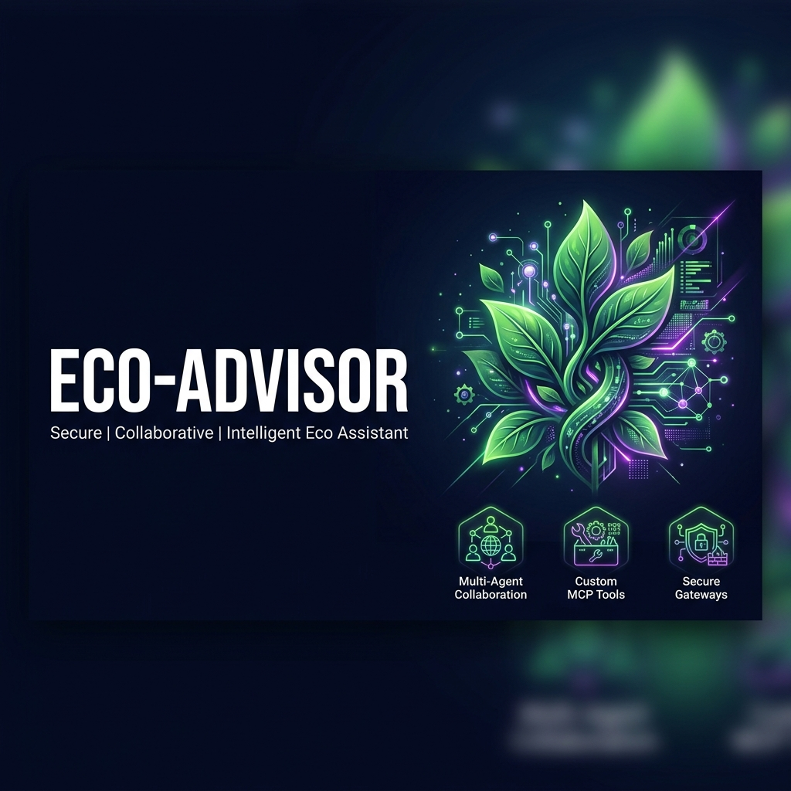

# eco-advisor — Secure Multi-Agent Sustainability Assistant

`eco-advisor` is an intelligent, secure, multi-agent system powered by the ADK 2.0 Workflow API and Gemini 2.5. It helps users reduce their carbon footprint, track household waste, set custom green goals, and find local environmental events. It integrates a custom Model Context Protocol (MCP) server for localized sustainability tools, a robust security checkpoint node (PII scrubbing + injection detection), and human-in-the-loop (HITL) goal confirmation.

## Prerequisites

- **Python**: version 3.11 to 3.13
- **uv**: Python package manager — [Install](https://docs.astral.sh/uv/getting-started/installation/)
- **Gemini API Key**: obtain from [Google AI Studio](https://aistudio.google.com/apikey)

## Quick Start

1. Clone this repository:
   ```bash
   git clone <repo-url>
   cd eco-advisor
   ```

2. Configure environment (copy from `.env.example`):
   ```env
   GOOGLE_API_KEY=your_gemini_api_key_here
   GOOGLE_GENAI_USE_VERTEXAI=False
   GEMINI_MODEL=gemini-2.5-flash
   ```

3. Install dependencies:
   ```bash
   make install
   ```

4. Launch the local Playground UI:
   - **macOS / Linux**:
     ```bash
     make playground
     ```
   - **Windows** (use explicit dir to avoid wildcard crash):
     ```powershell
     uv run adk web app --host 127.0.0.1 --port 18081
     ```

## Architecture

The workflow graph orchestrates security validation, specialized sub-agent delegation, and human confirmation:



## How to Run

| Command | What it does |
|---------|-------------|
| `make install` | Install all Python dependencies |
| `make playground` | Launch interactive UI at http://localhost:18081 |
| `make run` | Start local FastAPI web server at http://127.0.0.1:8080 |
| `make test` | Run pytest test suite |

## Sample Test Cases

### Test Case 1: Carbon Emissions (MCP Tool)
- **Input**: `"How much CO2 does running an air conditioner for 5 hours emit?"`
- **Expected**: Routes to `carbon_expert` → calls `estimate_appliance_emissions` → returns ~2.85 kg CO2
- **Check**: Look for kWh and CO2 values in the response

### Test Case 2: Recycling Guidelines (MCP Tool)
- **Input**: `"How do I recycle plastic bottles in 90210?"`
- **Expected**: Routes to `waste_expert` → calls `get_recycling_rules` → returns curbside guidelines
- **Check**: Response mentions plastics #1/#2 in blue curbside bins

### Test Case 3: Goal Setting (HITL Flow)
- **Input**: `"I want to set a goal to reduce my household energy usage."`
- **Expected**: Workflow pauses — playground asks for confirmation
- **Check**: Type `yes` to confirm; goal is saved in session state

## Troubleshooting

1. **`ModuleNotFoundError: No module named 'mcp'`**:
   Run `uv sync` to install all dependencies into the virtual environment.

2. **`404 model not found`**:
   Verify your `.env` has `GEMINI_MODEL=gemini-2.5-flash`. The `gemini-1.5-*` family is retired and returns 404.

3. **Windows: server not reflecting code changes**:
   Hot-reload is disabled on Windows. After any code edit, fully stop and restart:
   ```powershell
   Get-Process -Id (Get-NetTCPConnection -LocalPort 18081 -ErrorAction SilentlyContinue).OwningProcess | Stop-Process -Force
   uv run adk web app --host 127.0.0.1 --port 18081
   ```

## Assets





## Demo Script

See [DEMO_SCRIPT.txt](DEMO_SCRIPT.txt) for the full 3-4 minute spoken demo narration.

## Push to GitHub

1. Create a new repo at https://github.com/new
   - Name: `eco-advisor`
   - Visibility: Public or Private
   - **Do NOT** initialize with README (you already have one)

2. In your terminal, navigate into the project folder:
   ```bash
   cd eco-advisor
   git init
   git add .
   git commit -m "Initial commit: eco-advisor ADK agent"
   git branch -M main
   git remote add origin https://github.com/<your-username>/eco-advisor.git
   git push -u origin main
   ```

3. Verify `.gitignore` protects secrets:
   - `.env` ← API key — must **NEVER** be pushed
   - `.venv/`
   - `__pycache__/`
   - `*.pyc`
   - `.adk/`

⚠️ **NEVER push `.env` to GitHub. Your API key will be exposed publicly.**
