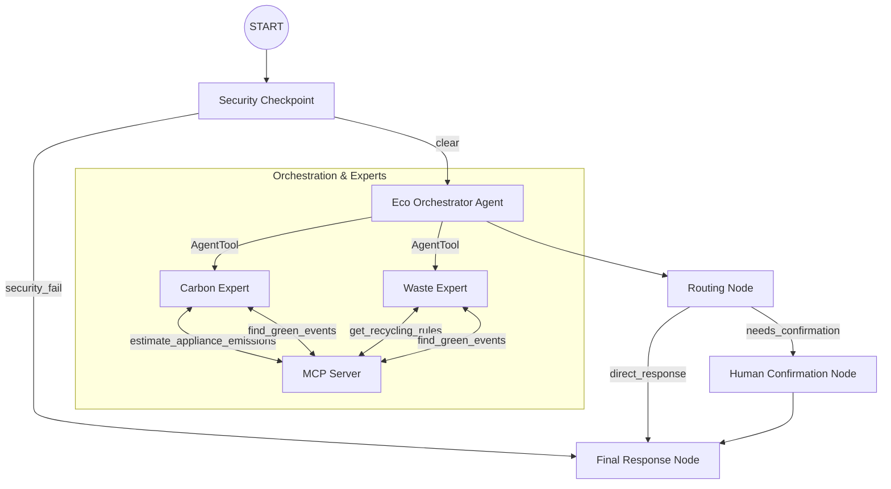

# Submission Write-Up: eco-advisor

## Problem Statement

Climate change and household carbon emissions are critical challenges, but individuals often lack personalized, local, and actionable guidance to reduce their environmental impact. Curbside recycling rules are highly fragmented by municipality (ZIP code), average consumers do not understand the greenhouse gas emissions of their daily home appliances, and setting sustainable habit-forming goals requires a structured confirmation workflow to ensure commitment. `eco-advisor` solves this by delivering a secure, specialized, multi-agent assistant that provides tailored energy calculations, local recycling lookups, and interactive green goal tracking.

## Solution Architecture

The system utilizes a secure ADK 2.0 Workflow graph that routes requests through specialized experts and pauses for user confirmation:

## Concepts Used

1. **ADK Workflow Graph API (ADK 2.0)**: Used in [agent.py](file:///c:/Users/HP/OneDrive/Documents/adk_workspace/eco-advisor/app/agent.py#L182-L198) to declare sequential, conditional, and converging execution nodes (`security_checkpoint`, `eco_orchestrator`, `routing_node`, `human_confirmation_node`, `final_response_node`) instead of flat LLM chats.
2. **LlmAgent**: Standard agent instances used for specialized domain knowledge ([agent.py:L33-L57](file:///c:/Users/HP/OneDrive/Documents/adk_workspace/eco-advisor/app/agent.py#L33-L57)), each with custom instructions and strict outputs.
3. **AgentTool**: Used in [agent.py:L70](file:///c:/Users/HP/OneDrive/Documents/adk_workspace/eco-advisor/app/agent.py#L70) to allow the coordinator (`eco_orchestrator`) to dynamically call and delegate questions to `carbon_expert` and `waste_expert`.
4. **MCP Server**: Implemented in [mcp_server.py](file:///c:/Users/HP/OneDrive/Documents/adk_workspace/eco-advisor/app/mcp_server.py) using the FastMCP framework, exposing three tools: `get_recycling_rules`, `estimate_appliance_emissions`, and `find_green_events`.
5. **Security Checkpoint**: Implemented in [agent.py:L76-L135](file:///c:/Users/HP/OneDrive/Documents/adk_workspace/eco-advisor/app/agent.py#L76-L135) to handle prompt injection checks, PII redaction, relevance validation, and structured logging.
6. **Agents CLI**: Project bootstrapped via `google-agents-cli scaffold` and configured for local dev and testing.

## Security Design

- **PII Scrubbing**: To protect user privacy, regex checks automatically redact email addresses and phone numbers before they are sent to the LLM.
- **Prompt Injection Detection**: Scans user input for adversarial instructions (e.g., "ignore previous instructions", "override rules"). If detected, the workflow immediately redirects to a security failure response.
- **Structured Audit Logging**: Write JSON logs of all security checks, tracking PII scrub counts, prompt injection block severity, and off-topic warnings.
- **Topic Relevance Validation**: Filters out requests unrelated to sustainability (e.g. general business or tech advice) to prevent resource misuse.

## MCP Server Design

The Model Context Protocol (MCP) server runs locally and exposes domain-specific tools:
- `get_recycling_rules`: Fetches specialized regional rules for common items (plastics, electronics, glass, batteries, etc.).
- `estimate_appliance_emissions`: Computes electricity usage (kWh) and associated CO2 emissions (kg) based on appliance type and duration.
- `find_green_events`: Connects users to nearby ecological volunteering activities.

## HITL Flow

When a user asks to establish a weekly green habit (e.g., "set a goal to compost"), the `eco_orchestrator` detects the intent, and the workflow routes to `human_confirmation_node`. This node yields a `RequestInput` event to pause execution. The user must explicitly reply `yes` to save the goal in `ctx.state["confirmed_goal"]`.

## Demo Walkthrough

### Test Case 1: Carbon Emissions calculation
- **Input**: *"How much CO2 does running an air conditioner for 5 hours emit?"*
- **Result**: The orchestrator delegates to `carbon_expert`, which uses `estimate_appliance_emissions` to show the AC emits roughly 2.85 kg of CO2.

### Test Case 2: Local recycling rules
- **Input**: *"How do I recycle plastic bottles in 90210?"*
- **Result**: The orchestrator delegates to `waste_expert`, which uses `get_recycling_rules` to provide the curbside guidelines for plastics.

### Test Case 3: Goal Setting & Confirmation
- **Input**: *"I want to set a goal to reduce my energy usage"*
- **Result**: The workflow pauses, prompting the user to type `yes` to confirm. Once typed, the goal is saved in session state.

## Impact / Value Statement

`eco-advisor` empowers citizens to make eco-friendly decisions daily by combining LLM reasoning with accurate local recycling data and structured carbon calculations. It ensures corporate data compliance via its integrated security checkpoint, making it suitable for deployment in community websites, smart home hubs, and corporate sustainability portals.
